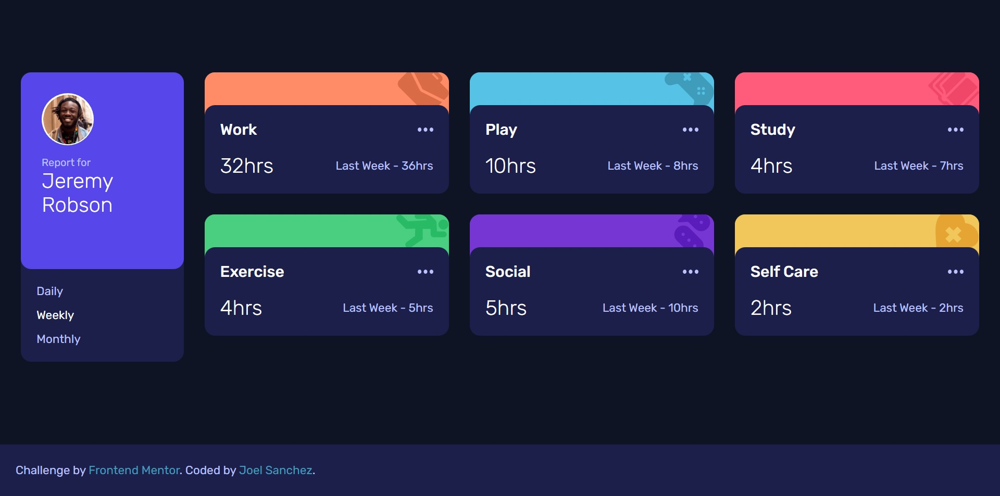

# Frontend Mentor - Time tracking dashboard solution

This is a solution to the [Time tracking dashboard challenge on Frontend Mentor](https://www.frontendmentor.io/challenges/time-tracking-dashboard-UIQ7167Jw).

## Table of contents

- [Overview](#overview)
  - [The challenge](#the-challenge)
  - [Screenshot](#screenshot)
  - [Links](#links)
- [My process](#my-process)
  - [Built with](#built-with)
- [Author](#author)

## Overview

### The challenge

Users should be able to:

- View the optimal layout for the site depending on their device's screen size
- See hover states for all interactive elements on the page
- Switch between viewing Daily, Weekly, and Monthly stats

### Screenshot

### Links

- Solution URL: [Github](https://github.com/sanchez-dev1906/frontendmentor---challenge-11/)
- Live Site URL: [Github Pages](https://sanchez-dev1906.github.io/frontendmentor---challenge-11/)

## My process

### Built with

- CSS custom properties
- Flexbox
- CSS Grid
- Mobile-first workflow
- Sass
- Javascript

## Author

- Website - [sanchez-dev1906.github.io](https://sanchez-dev1906.github.io)
- Github - [sanchez-dev1906](https://github.com/sanchez-dev1906)
- Frontend Mentor - [@sanchez-dev1906](https://www.frontendmentor.io/profile/sanchez-dev1906)
